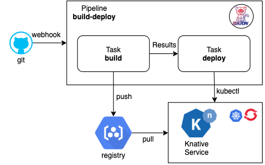

# Tutorial: Knative + Tekton
## Linux Foundation Open Source Summit NA 2020

Slides: [Knative-Tekton-OSSNA.pdf](./slides/Knative-Tekton-OSSNA.pdf)



Last Update: _2020/09/18_

<details><summary>1. Setup Environment</summary>

### 1. Setup Environment

<details><summary>1.1 Setup Kubernetes Clusters</summary>

<details><summary>1.1.1 IBM Free Kubernetes Cluster</summary>

- Get a free Kubernetes cluster on [IBM Cloud](https://cloud.ibm.com), also check out the booth at OSS-NA IBM booth during the conference how to get $200 credit.
    - Video: [How to get a free IBM Cloud Account](https://youtu.be/YVvZEG2Isqw)
    - Video: [How to get a free Kubernetes Cluster on IBM Cloud](https://youtu.be/g9LXeQgTEcM)
    - Video: [How to connect to your Kubernetes Cluster using IBM Cloud Shell](https://youtu.be/sn-6ROEvqns)

1. Select cluster from IBM Cloud console
1. Click the drop down Action menu on the top right and select [**Connect via CLI**](https://cloud.ibm.com/docs/cli?topic=cli-install-ibmcloud-cli#shell_install) and follow the commands.
1. Log in to your IBM Cloud account
    ```bash
    ibmcloud login -a cloud.ibm.com -r <REGION> -g <IAM_RESOURCE_GROUP>
    ```
1. Set the Kubernetes context
    ```bash
    ibmcloud ks cluster config -c mycluster
    ```
1. Verify that you can connect to your cluster.
    ```bash
    kubectl version --short
    ```

</details>

<details><summary>1.1.2 Kubernetes with Minikube</summary>

1. Install [minikube](https://minikube.sigs.k8s.io) Linux, MacOS, or Windows. This tutorial was tested with version `v1.13.0`. You print current and latest version number
    ```
    minikube update-check
    ```
1. Configure your cluster 2 CPUs, 2 GB Memory, and version of kubernetes `v1.18.5`. If you already have a minikube with different config, you need to delete it for new configuration to take effect or create a new profile.
    ```
    minikube delete
    minikube config set cpus 2
    minikube config set memory 2048
    minikube config set kubernetes-version v1.19.2
    ```
1. Start your minikube cluster
    ```
    minikube start
    ```
1. Verify versions if the `kubectl`, the cluster, and that you can connect to your cluster.
    ```bash
    kubectl version --short
    ```

</details>

<details><summary>1.1.3 Kubernetes with Kind (Kubernetes In Docker)</summary>

1. Install [kind](https://kind.sigs.k8s.io/docs/user/quick-start/) Linux, MacOS, or Windows. This tutorial was tested with version `v0.8.1`. You can verify version with
    ```bash
    kind --version
    ```
1. A kind cluster manifest file [clusterconfig.yaml](./kind/clusterconfig.yaml) is already provided, you can customize it. We are exposing port `80` on they host to be later use by the Knative Kourier ingress. To use a different version of kubernetes check the image digest to use from the kind [release page](https://github.com/kubernetes-sigs/kind/releases)
    ```yaml
    kind: Cluster
    apiVersion: kind.x-k8s.io/v1alpha4
    nodes:
    - role: control-plane
      image: kindest/node:v1.18.2@sha256:7b27a6d0f2517ff88ba444025beae41491b016bc6af573ba467b70c5e8e0d85f
      extraPortMappings:
      - containerPort: 31080 # expose port 31380 of the node to port 80 on the host, later to be use by kourier ingress
        hostPort: 80
    ```
1. Create and start your cluster, we specify the config file above
    ```
    kind create cluster --name knative --config kind/clusterconfig.yaml
    ```
1. Verify the versions of the client `kubectl` and the cluster api-server, and that you can connect to your cluster.
    ```bash
    kubectl cluster-info --context kind-knative
    ```

</details>

<details><summary>1.1.4 Kubernetes with Katacoda</summary>

- For a short version of this tutorial try it out on my [Katacoda Scenario](https://www.katacoda.com/csantanapr/)

</details>

</details>

<details><summary>1.2 Setup Command Line Interface (CLI) Tools</summary>

- [Kubernetes CLI](https://kubernetes.io/docs/tasks/tools/install-kubectl) `kubectl`
- [Knative CLI](https://knative.dev/docs/install/install-kn/) `kn`
- [Tekton CLI](https://github.com/tektoncd/cli#installing-tkn) `tkn`

</details>

<details><summary>1.3 Setup Container Registry</summary>

1. Get access to a container registry such as quay, dockerhub, or your own private registry instance from a Cloud provider such as IBM Cloud 😉. On this tutorial we are going to use [Dockerhub](https://hub.docker.com/)
1. Set the environment variables `REGISTRY_SERVER`, `REGISTRY_NAMESPACE` and `REGISTRY_PASSWORD`, The `REGISTRY_NAMESPACE` most likely would be your dockerhub username. For Dockerhub use `docker.io` as the value for `REGISTRY_SERVER`
    ```bash
    REGISTRY_SERVER='docker.io'
    REGISTRY_NAMESPACE='REPLACEME_DOCKER_USERNAME_VALUE'
    REGISTRY_PASSWORD='REPLACEME_DOCKER_PASSWORD'
    ```
1. You can use the file [.template.env](./.template.env) as template for the variables
    ```bash
    cp .template.env .env
    # edit the file .env with variables and credentials the source the file
    source .env
    ```

</details>

<details><summary>1.4 Setup Git</summary>

- Get access to a git server such as gitlab, github, or your own private git instance from a Cloud provider such as IBM Cloud 😉. On this tutorial we are going to use [GitHub](https://github.com/)

1. Fork this repository https://github.com/csantanapr/knative-tekton
1. Set the environment variable `GIT_REPO_URL` to the url of your fork, not mine.
    ```bash
    GIT_REPO_URL='https://github.com/REPLACEME/knative-tekton'
    ```
1. Clone the repository and change directory
    ```bash
    git clone $GIT_REPO_URL
    cd knative-tekton
    ```
1. You can use the file [.template.env](./.template.env) as template for the variables
    ```bash
    cp .template.env .env
    # edit the file .env with variables and credentials the source the file
    source .env
    ```

</details>


</details>

<details><summary>2. Install Knative Serving</summary>

### 2. Install Knative Serving

1. Install Knative Serving in namespace `knative-serving`
    ```bash
    kubectl apply -f https://github.com/knative/serving/releases/download/v0.17.2/serving-crds.yaml
    kubectl apply -f https://github.com/knative/serving/releases/download/v0.17.2/serving-core.yaml
    kubectl wait deployment activator autoscaler controller webhook --for=condition=Available -n knative-serving
    ```
1. Install Knative Layer kourier in namespace `kourier-system`
    ```
    kubectl apply -f https://github.com/knative/net-kourier/releases/download/v0.17.1/kourier.yaml
    kubectl wait deployment 3scale-kourier-gateway --for=condition=Available -n kourier-system
    kubectl wait deployment 3scale-kourier-control --for=condition=Available -n knative-serving
    ```
1. Set the environment variable `EXTERNAL_IP` to External IP Address of the Worker Node
    If using minikube:
    ```bash
    EXTERNAL_IP=$(minikube ip)
    echo EXTERNAL_IP=$EXTERNAL_IP
    ```
    If using kind:
    ```bash
    EXTERNAL_IP="127.0.0.1"
    ```
    If using IBM Kubernetes:
    ```bash
    EXTERNAL_IP=$(kubectl get nodes -o jsonpath='{.items[0].status.addresses[?(@.type=="ExternalIP")].address}')
    ```
    Verify the value
    ```bash
    echo EXTERNAL_IP=$EXTERNAL_IP
    ```
2. Set the environment variable `KNATIVE_DOMAIN` as the DNS domain using `nip.io`
    ```bash
    KNATIVE_DOMAIN="$EXTERNAL_IP.nip.io"
    echo KNATIVE_DOMAIN=$KNATIVE_DOMAIN
    ```
    Double check DNS is resolving
    ```bash
    dig $KNATIVE_DOMAIN
    ```
1. Configure DNS for Knative Serving
    ```bash
    kubectl patch configmap -n knative-serving config-domain -p "{\"data\": {\"$KNATIVE_DOMAIN\": \"\"}}"
    ```
1. Configure Kourier to listen for http port 80 on the node
    <details><summary>If using Kind then use this</summary>

    ```bash
    cat <<EOF | kubectl apply -f -
    apiVersion: v1
    kind: Service
    metadata:
      name: kourier-ingress
      namespace: kourier-system
      labels:
        networking.knative.dev/ingress-provider: kourier
    spec:
      type: NodePort
      selector:
        app: 3scale-kourier-gateway
      ports:
        - name: http2
          nodePort: 31080
          port: 80
          targetPort: 8080
    EOF
    ```

    </details>

    <details><summary>If not using Kind then use this</summary>

    ```bash
    cat <<EOF | kubectl apply -f -
    apiVersion: v1
    kind: Service
    metadata:
      name: kourier-ingress
      namespace: kourier-system
      labels:
        networking.knative.dev/ingress-provider: kourier
    spec:
      selector:
        app: 3scale-kourier-gateway
      ports:
        - name: http2
          port: 80
          targetPort: 8080
      externalIPs:
        - $EXTERNAL_IP
    EOF
    ```

    </details>

1. Configure Knative to use Kourier
    ```bash
    kubectl patch configmap/config-network \
      --namespace knative-serving \
      --type merge \
      --patch '{"data":{"ingress.class":"kourier.ingress.networking.knative.dev"}}'
    ```
1. Verify that Knative is Installed properly all pods should be in `Running` state and our `kourier-ingress` service configured.
    ```bash
    kubectl get pods -n knative-serving
    kubectl get pods -n kourier-system
    kubectl get svc  -n kourier-system kourier-ingress
    ```

</details>

<details><summary>3. Using Knative to Run Serverless Applications</summary>

### 3. Using Knative to Run Serverless Applications

1. Set the environment variable `SUB_DOMAIN` to the kubernetes namespace with Domain name `<namespace>.<domainname>` this way we can use any kubernetes namespace other than `default`
    ```bash
    CURRENT_CTX=$(kubectl config current-context)
    CURRENT_NS=$(kubectl config view -o=jsonpath="{.contexts[?(@.name==\"${CURRENT_CTX}\")].context.namespace}")
    if [[ -z "${CURRENT_NS}" ]]; then CURRENT_NS="default" fi
    SUB_DOMAIN="$CURRENT_NS.$KNATIVE_DOMAIN"
    echo "\n\nSUB_DOMAIN=$SUB_DOMAIN"
    ```

<details><summary>3.1 Create Knative Service</summary>

#### 3.1 Create Knative Service

1. Using the Knative CLI `kn` deploy an application usig a Container Image
    ```bash
    kn service create hello --image gcr.io/knative-samples/helloworld-go --autoscale-window 15s
    ```
    You can set a lower window. The service is scaled to zero if no request was receivedin during that time.
    ```bash
    --autoscale-window 10s
    ```
1. You can list your service
    ```bash
    kn service list hello
    ```
1. Use curl to invoke the Application
    ```bash
    curl http://hello.$SUB_DOMAIN
    ```
    It should print
    ```
    Hello World!
    ```
1. You can watch the pods and see how they scale down to zero after http traffic stops to the url
    ```
    kubectl get pod -l serving.knative.dev/service=hello -w
    ```

    Output should look like this after a few seconds when http traffic stops:
    ```
    NAME                                     READY   STATUS
    hello-r4vz7-deployment-c5d4b88f7-ks95l   2/2     Running
    hello-r4vz7-deployment-c5d4b88f7-ks95l   2/2     Terminating
    hello-r4vz7-deployment-c5d4b88f7-ks95l   1/2     Terminating
    hello-r4vz7-deployment-c5d4b88f7-ks95l   0/2     Terminating
    ```

    Try to access the url again, and you will see the new pods running again.
    ```
    NAME                                     READY   STATUS
    hello-r4vz7-deployment-c5d4b88f7-rr8cd   0/2     Pending
    hello-r4vz7-deployment-c5d4b88f7-rr8cd   0/2     ContainerCreating
    hello-r4vz7-deployment-c5d4b88f7-rr8cd   1/2     Running
    hello-r4vz7-deployment-c5d4b88f7-rr8cd   2/2     Running
    ```
    Some people call this **Serverless** 🎉 🌮 🔥
</details>

<details><summary>3.2 Updating the Knative service</summary>

#### 3.2 Updating the Knative service

1. Update the service hello with a new environment variable `TARGET`
    ```bash
    kn service update hello --env TARGET="World from v1" --revision-name "hello-v1"
    ```
1. Now invoke the service
    ```bash
    curl http://hello.$SUB_DOMAIN
    ```
    It should print
    ```
    Hello World from v1!
    ```

</details>

<details><summary>3.3 Knative Service Traffic Splitting</summary>

#### 3.3 Knative Service Traffic Splitting

1. Update the service hello by updating the environment variable `TARGET`, send 25% traffic to this new revision `hello-v2` and leaving 75% of the traffic to `hello-v1`
    ```bash
    kn service update hello \
      --env TARGET="Knative from v2" \
      --revision-name="hello-v2" \
      --traffic hello-v1=75,hello-v2=25
    ```
1. Describe the service to see the traffic split details
    ```bash
    kn service describe hello
    ```
    Should print this
    ```
    Name:       hello
    Age:        6m
    URL:        http://hello.$SUB_DOMAIN

    Revisions:
      25%  hello-v2 (current @latest) [3] (27s)
            Image:  gcr.io/knative-samples/helloworld-go (pinned to 5ea96b)
      75%  hello-v1 [2] (4m)
            Image:  gcr.io/knative-samples/helloworld-go (pinned to 5ea96b)
    ```
1. Invoke the service usign a while loop you will see the message `Hello Knative from v2` 25% of the time
    ```bash
    while true; do
    curl http://hello.$SUB_DOMAIN
    sleep 0.5
    done
    ```
    Should print this
    ```
    Hello World from v1!
    Hello Knative from v2!
    Hello World from v1!
    Hello World from v1!
    ```
1. Update the service this time dark launch new version `hello-v3` on a specific url, zero traffic will go to this version from the main url of the service
    ```bash
    kn service update hello \
      --env TARGET="OSS NA 2020 from v3" \
      --revision-name="hello-v3" \
      --traffic hello-v1=75,hello-v2=25,hello-v3=0
    ```
1. Describe the service to see the traffic split details, `v3` doesn't get any traffic
    ```bash
    kn service describe  hello
    ```
    Should print this
    ```
    Revisions:
      +  hello-v3 (current @latest) [4] (1m)
            Image:  gcr.io/knative-samples/helloworld-go (pinned to 5ea96b)
    25%  hello-v2 [3] (6m)
            Image:  gcr.io/knative-samples/helloworld-go (pinned to 5ea96b)
    75%  hello-v1 [2] (7m)
            Image:  gcr.io/knative-samples/helloworld-go (pinned to 5ea96b)
    ```
1. The revision `hello-v3` is deployed with 0% traffic, but is not accesible by hostname routing. Update the this revision with a tag to create a custom hostname to be able to access the revision for testing/debugging then go ahead and invoke the latest directly.
    Tag the revision `hello-v3`
    ```bash
    kn service update hello --tag hello-v3=v3
    ```
    ```bash
    curl http://v3-hello.$SUB_DOMAIN
    ```
    It shoud print this
    ```
    Hello OSS NA from v3!
    ```
1. We are happy with our darked launch version of the application, lets turn it live to 100% of the users on the default url
    ```bash
    kn service update hello --traffic @latest=100
    ```
1. Describe the service to see the traffic split details, `@latest` now gets 100% of the traffic
    ```bash
    kn service describe  hello
    ```
    Should print this
    ```
    Revisions:
        +  hello-v3 (current @latest) #v3 [4] (8m)
            Image:  gcr.io/knative-samples/helloworld-go (pinned to 5ea96b)
      100%  @latest (hello-v3) [4] (8m)
            Image:  gcr.io/knative-samples/helloworld-go (pinned to 5ea96b)
    ```
1. If we invoke the service in a loop you will see that 100% of the traffic is directed to revision `hello-v3` of our application
    ```bash
    while true; do
    curl http://hello.$SUB_DOMAIN
    sleep 0.5
    done
    ```
    Should print this
    ```
    Hello OSS NA 2020 from v3!
    Hello OSS NA 2020 from v3!
    Hello OSS NA 2020 from v3!
    Hello OSS NA 2020 from v3!
    ```
1. By using tags the custom urls with tag prefix are still available, in case you want to access an old revision of the application.
    Tag the old revisions to be able to access them directly.
    ```bash
    kn service update hello --tag hello-v1=v1 --tag hello-v2=v2
    ```
    ```bash
    curl http://v1-hello.$SUB_DOMAIN
    curl http://v2-hello.$SUB_DOMAIN
    curl http://v3-hello.$SUB_DOMAIN
    ```
    It should print
    ```
    Hello World from v1!
    Hello Knative from v2!
    Hello OSS NA 2020 from v3!
    ```
1. Now that you have your service configure and deploy, you want to reproduce this using a kubernetes manifest using YAML in a different namespace or cluster. You can define your Knative service using the following YAML you can use the command `kn service export`
    <details><summary>Show me the Knative YAML</summary>

    ```yaml
    ---
    apiVersion: serving.knative.dev/v1
    kind: Service
    metadata:
      name: hello
    spec:
      template:
        metadata:
          name: hello-v1
        spec:
          containers:
            - image: gcr.io/knative-samples/helloworld-go
              env:
                - name: TARGET
                  value: World from v1
    ---
    apiVersion: serving.knative.dev/v1
    kind: Service
    metadata:
      name: hello
    spec:
      template:
        metadata:
          name: hello-v2
        spec:
          containers:
            - image: gcr.io/knative-samples/helloworld-go
              env:
                - name: TARGET
                  value: Knative from v2
    ---
    apiVersion: serving.knative.dev/v1
    kind: Service
    metadata:
      name: hello
    spec:
      template:
        metadata:
          name: hello-v3
        spec:
          containers:
            - image: gcr.io/knative-samples/helloworld-go
              env:
                - name: TARGET
                  value: OSS NA 2020 from v3
      traffic:
        - latestRevision: false
          percent: 0
          revisionName: hello-v1
          tag: v1
        - latestRevision: false
          percent: 0
          revisionName: hello-v2
          tag: v2
        - latestRevision: true
          percent: 100
          tag: v3
    ```
    </details>

    If you want to deploy usign YAML, delete the Application with `kn` and redeploy with `kubectl`
    ```bash
    kn service delete hello
    kubectl apply -f knative/v1.yaml
    kubectl wait ksvc hello --timeout=-1s --for=condition=Ready
    kubectl apply -f knative/v2.yaml
    kubectl wait ksvc hello --timeout=-1s --for=condition=Ready
    kubectl apply -f knative/v3.yaml
    kubectl wait ksvc hello --timeout=-1s --for=condition=Ready
    ```
    Try the service again
    ```bash
    while true; do
    curl http://hello.$SUB_DOMAIN
    done
    ```
1. Delete the Application and all it's revisions
    ```bash
    kn service delete hello
    ```

</details>

</details>

<details><summary>4. Install Tekton Pipelines</summary>

### 4. Install Tekton

<details><summary>4.1 Install Tekton Pipelines</summary>

- Install Tekton Pipelines in namespace `tekton-pipelines`
    ```bash
    kubectl apply -f https://github.com/tektoncd/pipeline/releases/download/v0.14.1/release.yaml
    kubectl wait deployment tekton-pipelines-controller tekton-pipelines-webhook --for=condition=Available -n tekton-pipelines
    ```

</details>

<details><summary>4.2 Install Tekton Dashboard (Optional)</summary>

#### 4.2 Install Tekton Dashboard (Optional)

1. Install Tekton Dashboard in namespace `tekton-pipelines`
    ```bash
    kubectl apply -f https://github.com/tektoncd/dashboard/releases/download/v0.7.1/tekton-dashboard-release.yaml
    kubectl wait deployment tekton-dashboard --for=condition=Available -n tekton-pipelines
    ```
1. We can access the Tekton Dashboard serving using the Kourier Ingress using the `KNATIVE_DOMAIN`
    ```bash
    cat <<EOF | kubectl apply -f -
    apiVersion: networking.internal.knative.dev/v1alpha1
    kind: Ingress
    metadata:
      name: tekton-dashboard
      namespace: tekton-pipelines
      annotations:
        networking.knative.dev/ingress.class: kourier.ingress.networking.knative.dev
    spec:
      rules:
      - hosts:
        - dashboard.tekton-pipelines.$KNATIVE_DOMAIN
        http:
          paths:
          - splits:
            - appendHeaders: {}
              serviceName: tekton-dashboard
              serviceNamespace: tekton-pipelines
              servicePort: 9097
        visibility: ExternalIP
      visibility: ExternalIP
    EOF
    ```
1. Set an environment variable `TEKTON_DASHBOARD_URL` with the url to access the Dashboard
    ```bash
    TEKTON_DASHBOARD_URL=http://dashboard.tekton-pipelines.$KNATIVE_DOMAIN
    echo TEKTON_DASHBOARD_URL=$TEKTON_DASHBOARD_URL
    ```

</details>

</details>

<details><summary>5. Using Tekton to Build and Deploy Applications</summary>

### 5. Using Tekton to Build Applications

- Tekton helps create composable DevOps Automation by putting together **Tasks**, and **Pipelines**

<details><summary>5.1 Configure Credentials and ServiceAccounts for Tekton</summary>

#### 5.1 Configure Access for Tekton

1. We need to package our application in a Container Image and store this Image in a Container Registry. Since we are going to need to create secrets with the registry credentials we are going to create a ServiceAccount `pipelines` with the associated secret `regcred`. Make sure you setup your container credentials as environment variables. Checkout the [Setup Container Registry](#setup-container-registry) in the Setup Environment section on this tutorial. This commands will print your credentials make sure no one is looking over, the printed command is what you need to run.
    ```bash
    echo ""
    echo kubectl create secret docker-registry regcred \
      --docker-server=\'${REGISTRY_SERVER}\' \
      --docker-username=\'${REGISTRY_NAMESPACE}\' \
      --docker-password=\'${REGISTRY_PASSWORD}\'
    echo "\nRun the above command manually ^^ this avoids problems with certain charaters in your password on  the shell"
    ```
    NOTE: If you password have some characters that are interpreted by the shell, then do NOT use environment variables, explicit enter your values in the command wrapped by single quotes `'`
1. Verify the secret `regcred` was created
    ```
    kubectl describe secret regcred
    ```
1. Create a ServiceAccount `pipeline` that contains the secret `regsecret` that we just created
    ```yaml
    apiVersion: v1
    kind: ServiceAccount
    metadata:
      name: pipeline
    secrets:
      - name: regcred
    ```
    Run the following command with the provided `YAML`
    ```bash
    kubectl apply -f tekton/sa.yaml
    ```
1. We are going to be using Tekton to deploy the Knative Service, we need to configure RBAC to provide edit access to the current namespace `default` to the ServiceAccount `pipeline` if you are using a different namespace than `default` edit the file `tekton/rbac.yaml` and provide the namespace where to create the `Role` and the `RoleBinding` fo more info check out the [RBAC](https://kubernetes.io/docs/reference/access-authn-authz/rbac/) docs. Run the following command to grant access to sa `pipelines`
    ```bash
    cat tekton/rbac.yaml | sed "s/namespace: default/namespace: $CURRENT_NS/g" | kubectl apply -f -
    ```

</details>

<details><summary>5.2 The Build Tekton Task</summary>

#### 5.2 The Build Tekton Task

1. In this repository we have a sample application, you can see the source code in [./nodejs/app.js](./nodejs/app.js) This application is using JavaScript to implement a web server, but you can use any language you want.
    ```javascript
    const app = require("express")()
    const server = require("http").createServer(app)
    const port = process.env.PORT || "8080"
    const message = process.env.TARGET || 'Hello World'

    app.get('/', (req, res) => res.send(message))
    server.listen(port, function () {
        console.log(`App listening on ${port}`)
    });
    ```
1. I provided a Tekton Task that can download source code from git, build and push the Image to a registry.
    <details><summary>Show me the Build Task YAML</summary>

    ```yaml
    apiVersion: tekton.dev/v1beta1
    kind: Task
    metadata:
      name: build
    spec:
      params:
        - name: repo-url
          description: The git repository url
        - name: revision
          description: The branch, tag, or git reference from the git repo-url location
          default: master
        - name: image
          description: "The location where to push the image in the form of <server>/<namespace>/<repository>:<tag>"
        - name: CONTEXT
          description: Path to the directory to use as context.
          default: .
        - name: BUILDER_IMAGE
          description: The location of the buildah builder image.
          default: quay.io/buildah/stable:v1.14.8
        - name: STORAGE_DRIVER
          description: Set buildah storage driver
          default: overlay
        - name: DOCKERFILE
          description: Path to the Dockerfile to build.
          default: ./Dockerfile
        - name: TLSVERIFY
          description: Verify the TLS on the registry endpoint (for push/pull to a non-TLS registry)
          default: "false"
        - name: FORMAT
          description: The format of the built container, oci or docker
          default: "oci"
      steps:
        - name: git-clone
          image: alpine/git
          script: |
            git clone $(params.repo-url) /source
            cd /source
            git checkout $(params.revision)
          volumeMounts:
            - name: source
              mountPath: /source
        - name: build-image
          image: $(params.BUILDER_IMAGE)
          workingdir: /source
          script: |
            echo "Building Image $(params.image)"
            buildah --storage-driver=$(params.STORAGE_DRIVER) bud --format=$(params.FORMAT) --tls-verify=$(params.TLSVERIFY) -f $(params.DOCKERFILE) -t $(params.image) $(params.CONTEXT)

            echo "Pushing Image $(params.image)"
            buildah  --storage-driver=$(params.STORAGE_DRIVER) push --tls-verify=$(params.TLSVERIFY) --digestfile ./image-digest $(params.image) docker://$(params.image)
          securityContext:
            privileged: true
          volumeMounts:
            - name: varlibcontainers
              mountPath: /var/lib/containers
            - name: source
              mountPath: /source
      volumes:
        - name: varlibcontainers
          emptyDir: {}
        - name: source
          emptyDir: {}
    ```
    </details>

1. Install the provided task _build_ like this.
    ```bash
    kubectl apply -f tekton/task-build.yaml
    ```
1. You can list the task that we just created using the `tkn` CLI
    ```bash
    tkn task ls
    ```
1. We can also get more details about the _build_ **Task** using `tkn task describe`
    ```bash
    tkn task describe build
    ```
1. Let's use the Tekton CLI to test our _build_ **Task** you need to pass the ServiceAccount `pipeline` to be use to run the Task. You will need to pass the GitHub URL to your fork or use this repository. You will need to pass the directory within the repository where the application in our case is `nodejs`. The repository image name is `knative-tekton`
    ```bash
    tkn task start build --showlog \
      -p repo-url=${GIT_REPO_URL} \
      -p image=${REGISTRY_SERVER}/${REGISTRY_NAMESPACE}/knative-tekton \
      -p CONTEXT=nodejs \
      -s pipeline
    ```
1. You can check out the container registry and see that the image was pushed to repository a minute ago, it should return status Code `200`
    ```bash
    curl -s -o /dev/null -w "%{http_code}\n" https://index.$REGISTRY_SERVER/v1/repositories/$REGISTRY_NAMESPACE/knative-tekton/tags/latest
    ```
</details>

<details><summary>5.3 The Deploy Tekton Task</summary>

### 5.3 The Deploy Tekton Task

1. I provided a Deploy Tekton Task that can run `kubectl` to deploy the Knative Application using a YAML manifest.
    <details><summary>Show me the Deploy Task YAML</summary>

    ```yaml
    apiVersion: tekton.dev/v1beta1
    kind: Task
    metadata:
      name: deploy
    spec:
      params:
        - name: repo-url
          description: The git repository url
        - name: revision
          description: The branch, tag, or git reference from the git repo-url location
          default: master
        - name: dir
          description: Path to the directory to use as context.
          default: .
        - name: yaml
          description: Path to the directory to use as context.
          default: ""
        - name: image
          description: Path to the container image
          default: ""
        - name: KUBECTL_IMAGE
          description: The location of the kubectl image.
          default: docker.io/csantanapr/kubectl
      steps:
        - name: git-clone
          image: alpine/git
          script: |
            git clone $(params.repo-url) /source
            cd /source
            git checkout $(params.revision)
          volumeMounts:
            - name: source
              mountPath: /source
        - name: kubectl-apply
          image: $(params.KUBECTL_IMAGE)
          workingdir: /source
          script: |

            if [ "$(params.image)" != "" ] && [ "$(params.yaml)" != "" ]; then
              yq w -i $(params.dir)/$(params.yaml) "spec.template.spec.containers[0].image" "$(params.image)"
              cat $(params.dir)/$(params.yaml)
            fi

            kubectl apply -f $(params.dir)/$(params.yaml)

          volumeMounts:
            - name: source
              mountPath: /source
      volumes:
        - name: source
          emptyDir: {}
    ```

    </details>

1. Install the provided task _deploy_ like this.
    ```bash
    kubectl apply -f tekton/task-deploy.yaml
    ```
1. You can list the task that we just created using the `tkn` CLI
    ```bash
    tkn task ls
    ```
1. We can also get more details about the _deploy_ **Task** using `tkn task describe`
    ```bash
    tkn task describe deploy
    ```
1. I provided a Task YAML that defines our Knative Application in [knative/service.yaml](./knative/service.yaml)
    ```yaml
    apiVersion: serving.knative.dev/v1
    kind: Service
    metadata:
      name: demo
    spec:
      template:
        spec:
          containers:
            - image: docker.io/csantanapr/knative-tekton
              imagePullPolicy: Always
              env:
                - name: TARGET
                  value: Welcome to the Knative Meetup
    ```
1. Let's use the Tekton CLI to test our _deploy_ **Task** you need to pass the ServiceAccount `pipeline` to be use to run the Task. You will need to pass the GitHub URL to your fork or use this repository. You will need to pass the directory within the repository where the application yaml manifest is located and the file name in our case is `knative` and `service.yaml` .
    ```bash
    tkn task start deploy --showlog \
      -p image=${REGISTRY_SERVER}/${REGISTRY_NAMESPACE}/knative-tekton \
      -p repo-url=${GIT_REPO_URL} \
      -p dir=knative \
      -p yaml=service.yaml \
      -s pipeline
    ```
1. You can check out that the Knative Application was deploy
    ```bash
    kn service list demo
    ```

</details>

<details><summary>5.4 The Build and Deploy Pipeline</summary>

#### 5.4 The Build and Deploy Pipeline

1. If we want to build the application image and then deploy the application, we can run the Tasks **build** and **deploy** by defining a **Pipeline** that contains the two Tasks, deploy the Pipeline `build-deploy`.
    <details><summary>Show me the Pipeline YAML</summary>

    ```yaml
    apiVersion: tekton.dev/v1beta1
    kind: Pipeline
    metadata:
      name: build-deploy
    spec:
      params:
        - name: repo-url
          default: https://github.com/csantanapr/knative-tekton
        - name: revision
          default: master
        - name: image
        - name: image-tag
          default: latest
        - name: CONTEXT
          default: nodejs
      tasks:
        - name: build
          taskRef:
            name: build
          params:
            - name: image
              value: $(params.image):$(params.image-tag)
            - name: repo-url
              value: $(params.repo-url)
            - name: revision
              value: $(params.revision)
            - name: CONTEXT
              value: $(params.CONTEXT)
        - name: deploy
          runAfter: [build]
          taskRef:
            name: deploy
          params:
            - name: image
              value: $(params.image):$(params.image-tag)
            - name: repo-url
              value: $(params.repo-url)
            - name: revision
              value: $(params.revision)
            - name: dir
              value: knative
            - name: yaml
              value: service.yaml
    ```
    </details>

1. Install the Pipeline with this command
    ```bash
    kubectl apply -f tekton/pipeline-build-deploy.yaml
    ```
1. You can list the pipeline that we just created using the `tkn` CLI
    ```bash
    tkn pipeline ls
    ```
1. We can also get more details about the _build-deploy_ **Pipeline** using `tkn pipeline describe`
    ```bash
    tkn pipeline describe build-deploy
    ```
1. Let's use the Tekton CLI to test our _build-deploy_ **Pipeline** you need to pass the ServiceAccount `pipeline` to be use to run the Tasks. You will need to pass the GitHub URL to your fork or use this repository. You will also pass the Image location where to push in the the registry and where Kubernetes should pull the image for the Knative Application. The directory and filename for the Kantive yaml are already specified in the Pipeline definition.
    ```bash
    tkn pipeline start build-deploy --showlog \
      -p image=${REGISTRY_SERVER}/${REGISTRY_NAMESPACE}/knative-tekton \
      -p repo-url=${GIT_REPO_URL} \
      -s pipeline
    ```
1. You can inpect the results and duration by describing the last **PipelineRun**
    ```bash
    tkn pipelinerun describe --last
    ```
1. Check that the latest Knative Application revision is ready
    ```bash
    kn service list demo
    ```
1. Run the Application using the url
    ```bash
    curl http://demo.$SUB_DOMAIN
    ```
    It shoudl print
    ```
    Welcome to OSS NA 2020
    ```
</details>

</details>


<details><summary>6. Automate the Tekton Pipeline using Git Web Hooks Triggers</summary>

### 6. Automate the Tekton Pipeline using Git Web Hooks

<details><summary>6.1 Install Tekton Triggers</summary>

#### 6.1 Install Tekton Triggers

1. Install Tekton Triggers in namespace `tekton-pipelines`
    ```bash
    kubectl apply -f https://github.com/tektoncd/triggers/releases/download/v0.6.1/release.yaml
    kubectl wait deployment tekton-triggers-controller tekton-triggers-webhook --for=condition=Available -n tekton-pipelines
    ```

</details>

<details><summary>6.2 Create TriggerTemplate, TriggerBinding</summary>

#### 6.2 Create TriggerTemplate, TriggerBinding

1. When the Webhook invokes we want to start a Pipeline, we will a `TriggerTemplate` to use a specification on which Tekton resources should be created, in our case will be creating a new `PipelineRun` this will start a new `Pipeline` install.
    <details><summary>Show me the TriggerTemplate YAML</summary>

    ```yaml
    apiVersion: triggers.tekton.dev/v1alpha1
    kind: TriggerTemplate
    metadata:
      name: build-deploy
    spec:
      params:
        - name: gitrevision
          description: The git revision
          default: master
        - name: gitrepositoryurl
          description: The git repository url
        - name: gittruncatedsha
        - name: image
          default: REPLACE_IMAGE
      resourcetemplates:
        - apiVersion: tekton.dev/v1beta1
          kind: PipelineRun
          metadata:
            generateName: build-deploy-run-
          spec:
            serviceAccountName: pipeline
            pipelineRef:
              name: build-deploy
            params:
              - name: revision
                value: $(params.gitrevision)
              - name: repo-url
                value: $(params.gitrepositoryurl)
              - name: image-tag
                value: $(params.gittruncatedsha)
              - name: image
                value: $(params.image)
    ```

    </details>

1. Install the TriggerTemplate
    ```bash
    cat tekton/trigger-template.yaml | sed "s/REPLACE_IMAGE/$REGISTRY_SERVER\/$REGISTRY_NAMESPACE\/knative-tekton/g" | kubectl apply -f -
    ```
1. When the Webhook invokes we want to extract information from the Web Hook http request sent by the Git Server, we will use a `TriggerBinding` this information is what gets passed to the `TriggerTemplate`.
    <details><summary>Show me the TriggerBinding YAML</summary>

    ```yaml
    apiVersion: triggers.tekton.dev/v1alpha1
    kind: TriggerBinding
    metadata:
      name: build-deploy
    spec:
      params:
        - name: gitrevision
          value: $(body.head_commit.id)
        - name: gitrepositoryurl
          value: $(body.repository.url)
        - name: gittruncatedsha
          value: $(body.extensions.truncated_sha)
    ```

    </details>

1. Install the TriggerBinding
    ```bash
    kubectl apply -f tekton/trigger-binding.yaml
    ```

</details>

<details><summary>6.3 Create Trigger EventListener</summary>

#### 6.3 Create Trigger EventListener

1. To be able to handle the http request sent by the GitHub Webhook, we need a webserver. Tekton provides a way to define this listeners that takes the `TriggerBinding` and the `TriggerTemplate` as specification. We can specify Interceptors to handle any customization for example I only want to start a new **Pipeline** only when push happens on the main branch.
    <details><summary>Show me the Trigger Eventlistener YAML</summary>

    ```yaml
    apiVersion: triggers.tekton.dev/v1alpha1
    kind: EventListener
    metadata:
      name: cicd
    spec:
      serviceAccountName: pipeline
      triggers:
        - name: cicd-trig
          bindings:
            - ref: build-deploy
          template:
            name: build-deploy
          interceptors:
            - cel:
                filter: "header.match('X-GitHub-Event', 'push') && body.ref == 'refs/heads/master'"
                overlays:
                  - key: extensions.truncated_sha
                    expression: "body.head_commit.id.truncate(7)"
    ```

    </details>

1. Install the Trigger EventListener
    ```bash
    kubectl apply -f tekton/trigger-listener.yaml
    ```
1. The Eventlister creates a deployment and a service you can list both using this command
    ```bash
    kubectl get deployments,eventlistener,svc -l eventlistener=cicd
    ```

</details>

<details><summary>6.4 Get URL for Git WebHook</summary>

#### 6.4 Get URL for Git WebHook

- If you are using the IBM Free Kubernetes cluster a public IP Address is alocated to your worker node and we will use this one for this part of the tutorial. It will depend on your cluster and how traffic is configured into your Kubernetes Cluster, you would need to configure an Application Load Balancer (ALB), Ingress, or in case of OpenShift a Route. If you are running the Kubernetes cluster on your local workstation using something like minikube, kind, docker-desktop, or k3s then I recommend a Cloud Native Tunnel solution like [inlets](https://docs.inlets.dev/#/) by the open source contributor [Alex Ellis](https://twitter.com/alexellisuk).

1. Expose the EventListener with Kourier
    ```bash
    cat <<EOF | kubectl apply -f -
    apiVersion: networking.internal.knative.dev/v1alpha1
    kind: Ingress
    metadata:
      name: el-cicd
      namespace: $CURRENT_NS
      annotations:
        networking.knative.dev/ingress.class: kourier.ingress.networking.knative.dev
    spec:
      rules:
      - hosts:
        -  el-cicd.$CURRENT_NS.$KNATIVE_DOMAIN
        http:
          paths:
          - splits:
            - appendHeaders: {}
              serviceName: el-cicd
              serviceNamespace: $CURRENT_NS
              servicePort: 8080
        visibility: ExternalIP
      visibility: ExternalIP
    EOF
    ```
1. Get the url using using `CURRENT_NS` and `KNATIVE_DOMAIN`
    ```bash
    GIT_WEBHOOK_URL=http://el-cicd.$CURRENT_NS.$KNATIVE_DOMAIN
    echo GIT_WEBHOOK_URL=$GIT_WEBHOOK_URL
    ```
    **WARNING:** Take into account that this URL is insecure is using http and not https, this means you should not use this type of URL for real work environments, In that case you would need to expose the service for the eventlistener using a secure connection using **https**
1. Add the Git Web Hook url to your Git repository
    1. Open Settings in your Github repository
    1. Click on the side menu **Webhooks**
    1. Click on the top right **Add webhook**
    1. Copy and paste the `$GIT_WEBHOOK_URL` value into the **Payload URL**
    1. Select from the drop down Content type **application/json**
    1. Select Send me **everything** to handle all types of git events.
    1. Click **Add webhook**
1. Now make a change to the application manifest such like changing the message in [knative/service.yaml](./knative/service.yaml) to something like `My First Serveless App @ OSS NA 2020  🎉 🌮 🔥 🤗!` and push the change to the `master` branch
1. (Optional) If you can't receive the git webhook, for example if using minikube you can emulate the git web hook using by sending a http request directly with git payload. You can edit the file [tekton/hook.json](./tekton/hook.json) to use a different git commit value.
    ```
    curl -H "X-GitHub-Event:push" -d @tekton/hook.json $GIT_WEBHOOK_URL
    ```
1. A new Tekton **PipelineRun** gets created starting a new **Pipeline** Instance. You can check in the Tekton Dashboard for progress of use the tkn CLI
    ```bash
    tkn pipeline logs -f --last
    ```
1. To see the details of the execution of the PipelineRun use the tkn CLI
    ```bash
    tkn pipelinerun describe --last
    ```
1. The Knative Application Application is updated with the new Image built using the tag value of the 7 first characters of the git commit sha, describe the service using the kn CLI
    ```bash
    kn service describe demo
    ```
1. Invoke your new built revision for the Knative Application
    ```bash
    curl http://demo.$SUB_DOMAIN
    ```
    It should print
    ```
    My First Serveless App @ OSS NA 2020  🎉 🌮 🔥 🤗!
    ```

</details>

</details>
